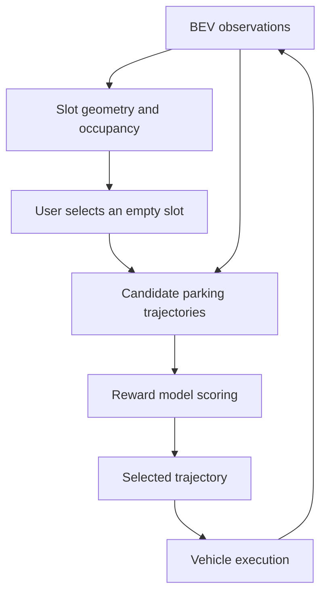

# BEV Parking with a Reward Model

[한국어](README_ko.md)

**Status: research concept.** A parking workflow that detects slots in BEV, lets a user choose an empty slot, and uses a reward model to evaluate candidate paths before execution.

## Proposed workflow

| Component | Intended role |
| --- | --- |
| BEV perception | Recognize parking slots, parked vehicles, and empty spaces |
| Target selection | Let the user choose an available slot |
| Planning | Generate paths to the selected slot |
| Reward model | Compare paths and select the highest-scoring feasible candidate |
| Execution | Follow the selected path and update observations |

The aspiration is an optimal parking path. A reward model alone does not guarantee a global optimum. The candidate generator, feasible-path definition, reward supervision, and vehicle controller remain unspecified.

## Questions for implementation

- How are free, occupied, and uncertain slots distinguished?
- What data trains the reward model: demonstrations, preferences, or measured outcomes?
- How do candidate paths respect vehicle dimensions, steering limits, and collision constraints?
- When should a selected slot or path be re-evaluated as the scene changes?

Suggested evaluation measures are parking success, collision rate, final pose error, maneuver count, and planning latency. Evaluation is planned.
