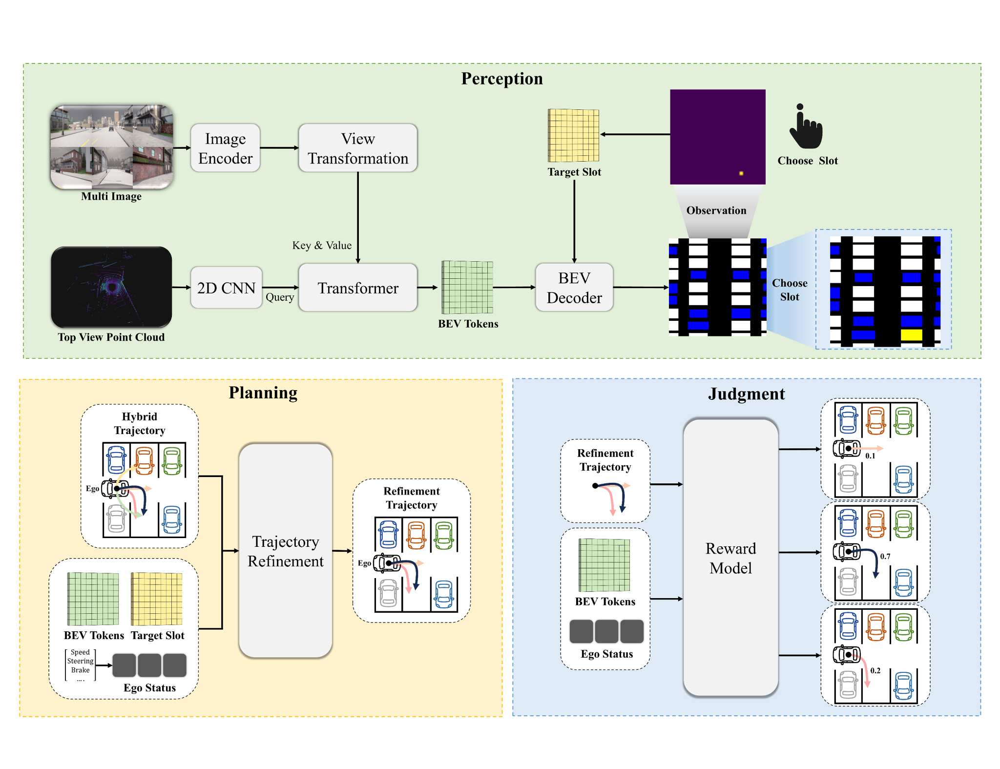

# BEV Parking with a Reward Model

[한국어](README_ko.md)

**Status: research concept.** A parking workflow that detects slots in BEV, lets a user choose an empty slot, and uses a reward model to evaluate candidate paths before execution.

## Questions for implementation

- How are free, occupied, and uncertain slots distinguished?
- What data trains the reward model: demonstrations, preferences, or measured outcomes?
- How do candidate paths respect vehicle dimensions, steering limits, and collision constraints?
- When should a selected slot or path be re-evaluated as the scene changes?

Suggested evaluation measures are parking success, collision rate, final pose error, maneuver count, and planning latency. Evaluation is planned.
