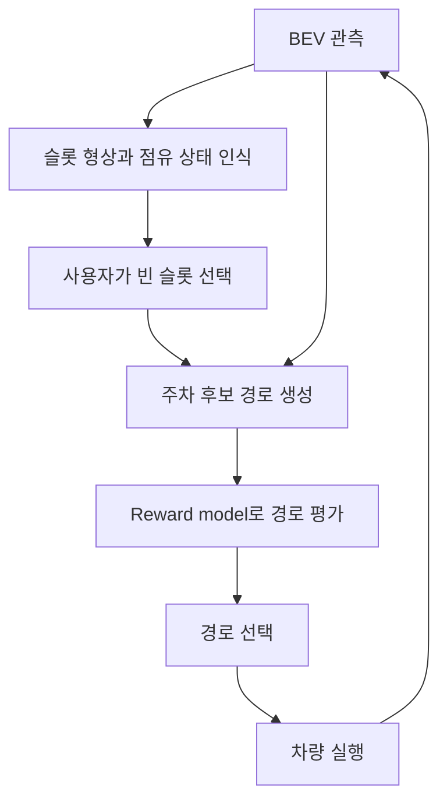

# BEV Parking with a Reward Model

[English](README.md)

**상태: 연구 아이디어 단계.** BEV에서 주차 슬롯과 빈 공간을 인식하고, 사용자가 빈 슬롯을 선택하면 reward model로 후보 경로를 평가해 주차를 수행하는 구상입니다.

| 구성 요소 | 역할 |
| --- | --- |
| BEV 인지 | 주차 슬롯, 주차된 차량, 빈 공간 인식 |
| 목표 선택 | 사용자가 주차할 빈 슬롯 선택 |
| 플래닝 | 선택한 슬롯까지의 후보 경로 생성 |
| Reward model | 실행 가능한 후보 중 보상이 높은 경로 선택 |
| 실행 | 선택한 경로를 추종하고 주변 관측 갱신 |

최적의 주차 경로를 얻는 것이 목표입니다. Reward model만으로 전역 최적 경로가 보장되는 것은 아닙니다. 후보 생성기, 실행 가능성 판정, 보상 모델 학습 방법, 제어기는 미정입니다.

## 구현 과제

- 빈 슬롯·점유 슬롯·불확실한 슬롯을 구분하는 기준
- 시연, 선호도, 실제 수행 결과 등 보상 모델의 학습 데이터
- 차량 크기·조향 한계·충돌 제약을 반영한 후보 경로
- 주변 상황이 바뀔 때 슬롯과 경로를 다시 평가하는 조건

평가 항목은 주차 성공률, 충돌률, 최종 자세 오차, 조작 횟수, 계획 지연시간 등으로 설정할 수 있습니다. 현재 자료에는 실험 결과가 없습니다.

## 출처

작성자가 이번에 설명한 연구 구상입니다. 첨부된 세 PPT에는 주차 구현 코드·가중치·전용 구조 그림이 포함되어 있지 않았습니다.
